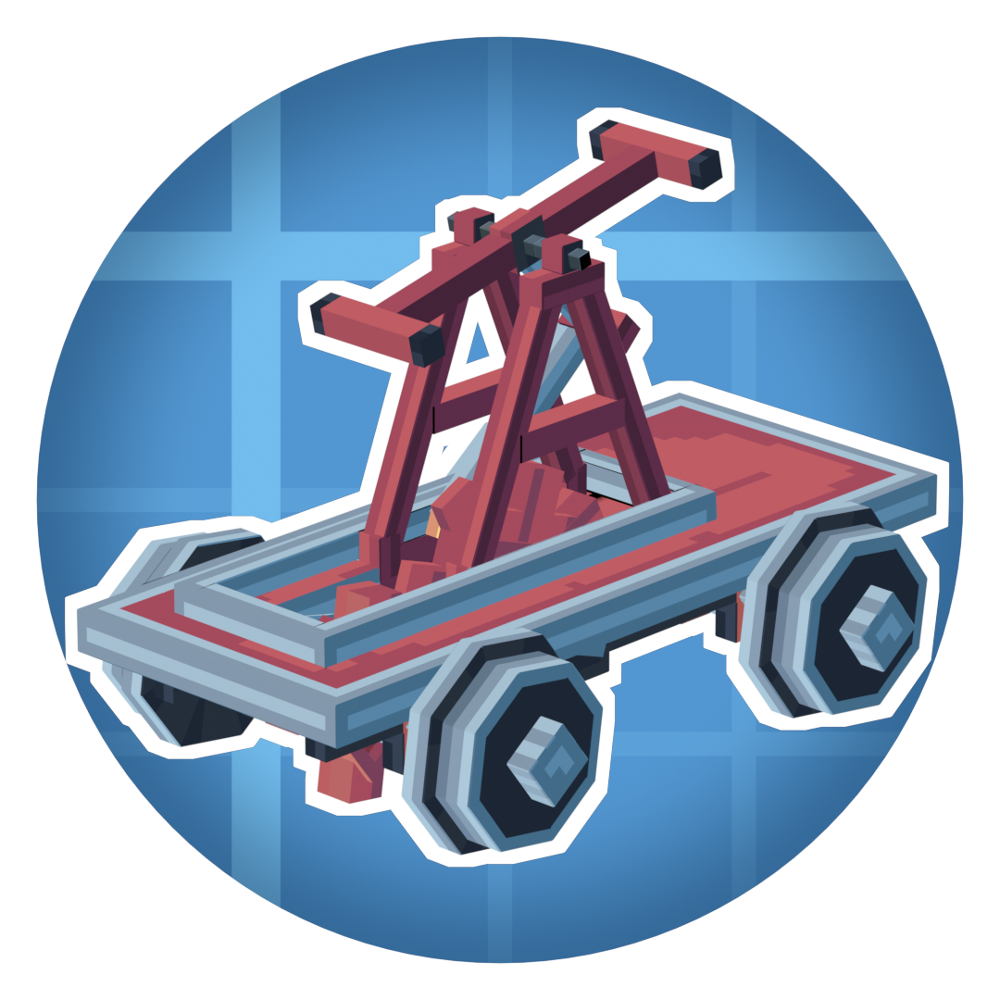

<div align="center">
  
  <h1>Create: Steam 'n' Rails — Create Fly port</h1>
  <p>Steam 'n' Rails for Fabric, Minecraft 26.2, and Create Fly.</p>

[](https://discord.gg/UKFkg5NQzu)
</div>

This repository ports [Create: Steam 'n' Rails](https://github.com/Layers-of-Railways/Railway) to the latest public version of [Create Fly](https://github.com/ZurrTum/Create-Fly) for stable Minecraft 26.2. Steam 'n' Rails expands Create's train and steam systems with custom tracks, semaphores, conductors, bogeys, palettes, and other railway content.

Ready-to-install builds are available on the [GitHub Releases page](https://github.com/cat4blep/Create-Steam-n-Rails-Fly/releases).

> [!IMPORTANT]
> This build targets stable Minecraft **26.2** exactly. The `rc-2` text in the historical Create Fly artifact filename does not change its published Minecraft compatibility metadata, which targets stable 26.2.

## Compatibility

| Component | Required version |
| --- | --- |
| Minecraft | `26.2` exactly |
| Mod loader | Fabric Loader `0.19.3` or newer |
| Fabric API | `0.152.0+26.2` or newer |
| Create | [Create Fly](https://github.com/ZurrTum/Create-Fly) `6.0.9-1` or newer |
| Java | 25 |
| This port | `1.7.2-fly.26.2-beta.2` |

This is a Fabric-only port. Forge and NeoForge are not supported. Use Create Fly rather than another Create implementation, and do not install the original Steam 'n' Rails JAR alongside this port.

## Installation

1. Install Java 25, Fabric Loader, and Fabric API for Minecraft 26.2.
2. Install the latest public Create Fly build compatible with Minecraft 26.2.
3. Put this port's non-sources JAR in the instance's `mods` directory.
4. Start the game and confirm that Fabric reports `railways`, `create`, and their dependencies as loaded.

Back up existing worlds before opening them with a beta port or a new Minecraft version.

## Port status

The port is currently in beta. The main mod is playable, but optional third-party integrations and development/datagen paths inherited from the upstream 1.20.x project are not all validated on 26.2.

Recent Create Fly compatibility work includes:

- enforcing bogey gauge compatibility when placing or cycling bogeys;
- restoring curved monorail geometry and monorail-specific selection outlines;
- fixing track-switch rendering, rail overlays, flickering, and related crashes;
- preventing animated locometal flywheels from rendering a second static wheel.

When reporting a problem, include the complete `latest.log` or crash report, a short reproduction sequence, and whether the issue also occurs with only Steam 'n' Rails and its required dependencies installed.

## Building from source

The project uses the included Gradle wrapper and requires JDK 25. Set `JAVA_HOME` to that JDK before building.

Windows PowerShell:

```powershell
./gradlew.bat clean build validateAccessWidener --no-daemon
```

Linux or macOS:

```bash
./gradlew clean build validateAccessWidener --no-daemon
```

The distributable JAR is written to `build/libs/`. Use the JAR without the `-sources` suffix. The first build also downloads the development dependencies and generates the connected-texture sprites used by this port.

### Datagen

For maintainer datagen tasks, set the following environment variable before running the relevant Gradle task:

```env
DATAGEN=TRUE
```

## Contributing

Open an issue before starting a large change so its scope can be agreed on and duplicate work can be avoided. Pull requests should describe the affected Minecraft/Create Fly versions and include the checks used to verify the change.

Branches for this port must be named **exactly** `<modloader>-<version>`, with no additional words or suffixes. The current branch is `fabric-26.2`.

Translations for the upstream project are managed through [Crowdin](https://crowdin.com/project/create-steam-n-rails-official). Translation questions can be asked in the [translator's chat](https://discord.com/channels/706277846389227612/1049156352553000970) on the Steam 'n' Rails Discord.

## License

Steam 'n' Rails is licensed under the LGPL license. See [LICENSE](LICENSE) for details.

Certain sections of the code are derived from projects with compatible licenses, including Create (MIT), Quilt Standard Libraries (Apache-2.0), SecurityCraft (MIT), Neruina (MIT), and FramedBlocks (LGPL). Their copyright and license notices remain applicable to the corresponding code.

## Credits

- [Layers of Railways](https://github.com/Layers-of-Railways/Railway) and its contributors for Create: Steam 'n' Rails.
- [ZurrTum/Create-Fly](https://github.com/ZurrTum/Create-Fly) and its contributors for the Create Fly port used by Minecraft 26.2.
- The original Create team and all projects credited in the source and license notices.

We use [YourKit Java Profiler](https://www.yourkit.com/java/profiler/) during mod development and thank YourKit for supporting open-source projects.
